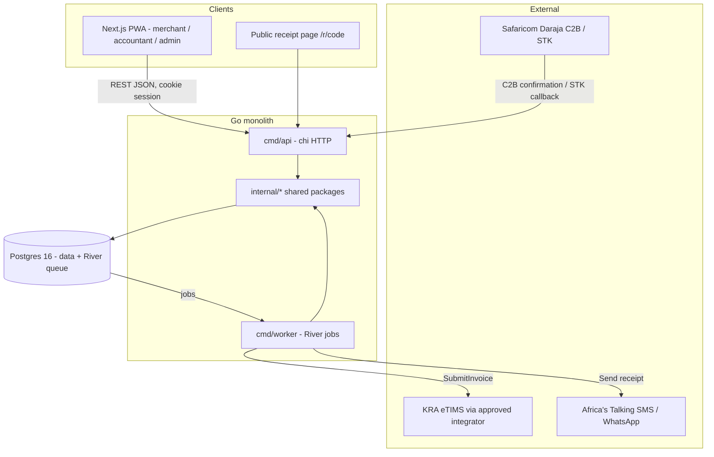

# Product Strategy

### Overview & Goals
**CiftPay** (C.I.F.T. = *Compliant Invoicing & Fund Tracking*) is a zero-custody SaaS that turns every M-Pesa payment a Kenyan business receives into a KRA **eTIMS**-compliant invoice, reconciles it into real-time books, and pushes the fiscal receipt to the buyer's phone. It is **not** a wallet and **not** a payment gateway: money keeps flowing Safaricom → merchant exactly as today; CiftPay owns the *compliance and intelligence layer* on top of the rail.

Goal of this session: produce an executable `plan.md`, supporting `docs/`, and a Phase-0 repository scaffold (Go modular monolith + Next.js PWA) that a coding agent can pick up and build phase by phase.

### Pain Hunt Tournament (summary)
| Candidate | Score /30 | Verdict |
|---|---|---|
| **A. eTIMS Compliance Rail** | **28** | **Winner** |
| C. Micro-employer statutory payroll via M-Pesa | 20 | Runner-up, Phase 4 module candidate |
| F. Gig-worker income passport | 20 | Absorbed: becomes the Phase-3 *Cash-flow Score* |
| B. Social-commerce escrow | 18 | Eliminated: custody ⇒ CBK PSP licence |
| G. Landlord/estate Paybill reconciliation | 17 | Absorbed as a vertical template |
| D. Matatu cashless fares | 16 | Eliminated: distribution graveyard (BebaPay) |
| E. Chama/SACCO treasury OS | 15 | Eliminated: crowded, low WTP |

**Forcing function:** Finance Act 2023 → since 1 Jan 2024 business expenses without an eTIMS invoice are non-deductible. Buyers now refuse suppliers who can't issue eTIMS invoices; KRA's own tools (eTIMS Lite, `*222#`) are manual and disconnected from M-Pesa, where the money actually lands.

### Killer Value Proposition
> "Get paid on M-Pesa like you always have. CiftPay issues the KRA invoice, sends the receipt to your customer, and keeps your books — before you've put your phone down."

- **Seller:** stays inside B2B supply chains; zero re-typing; month-end return pack in one tap.
- **Buyer:** receives a deductible eTIMS receipt by SMS/WhatsApp with a public verify link → every invoice is an acquisition event ("Issue yours with CiftPay").
- **Accountant:** one portal for all client merchants, clean VAT position, exports.

### Core Transaction Loop
1. Customer pays merchant's Till / Paybill / Pochi (or a CiftPay STK-push link / QR in Phase 2).
2. Daraja C2B confirmation → CiftPay ingests idempotently (`TransID`), normalises, matches to an open sale (BillRef / amount+phone window) or creates a **cash sale** with the shortcode's default item.
3. Worker builds the fiscal invoice (items, tax category, buyer PIN if known) and submits via the `fiscal.Provider` port (3rd-party KRA-approved integrator first).
4. KRA ack (invoice no., signature, QR) stored; buyer gets SMS/WhatsApp receipt with `ciftpay.co.ke/r/<code>` verify link.
5. Ledger, VAT position and monthly return draft update in real time; failures land in a **Needs attention** queue with retry/backoff.

### Business Model
| Tier | Price (KES/mo) | Includes |
|---|---|---|
| Hustler (free) | 0 | 1 shortcode, ≤30 invoices/mo, SMS receipts |
| Duka | 1,500 | ≤500 invoices, WhatsApp receipts, exports |
| Biashara | 4,500 | Unlimited, multi-outlet, accountant seat, API |
| Accountant | 9,000 | Up to 25 client orgs |

Overage: KES 5/invoice. Phase 3: origination fee (2–4 %) on revenue-based financing distributed via a licensed Digital Credit Provider partner — CiftPay never lends.

### Regulatory Posture (via third-party infrastructure)
- **No custody** → outside CBK PSP licensing (National Payment System Act 2011); documented in ADR-0003.
- **KYC is inherited, control is verified:** Safaricom KYC'd the shortcode owner, KRA verified the PIN. CiftPay checks *control*: KES 1 STK ping to the merchant's own MSISDN/Till, KRA PIN format + iTax PIN-checker lookup, OTP on the registered phone.
- **eTIMS:** operate through a KRA-approved third-party integrator (vendor adapter) at MVP; apply for CiftPay's own OSCU system-to-system integrator certification in Phase 3 (swap adapter, zero product change).
- **Data Protection Act 2019:** register with ODPC as data controller/processor; buyer PINs encrypted at rest (envelope encryption), minimal retention, DSAR endpoint.
- **Lending:** never on-balance-sheet; DCP-licensed partner in Phase 3.

### Scope
**In scope (this session):** `plan.md`, `docs/` (architecture, compliance, design system, data model, API contract, ADRs), Phase-0 scaffold for backend, web, infra, CI.
**Out of scope (this session):** real Daraja/eTIMS credentials, production deployment, Phase 1+ feature code (described in `plan.md`, not built now).

### User Stories
- As a **mama-mboga/duka owner**, I want every Till payment to become a KRA invoice automatically so that my B2B customers keep buying from me.
- As a **B2B buyer**, I want an eTIMS receipt on my phone seconds after paying so that I can deduct the expense.
- As an **accountant**, I want all my clients' M-Pesa income already reconciled and fiscalised so that month-end takes minutes.
- As a **merchant**, I want a "Needs attention" list of unmatched payments and failed submissions so that nothing slips.

### KPIs / Gates
- G1 (MVP): 10 design-partner merchants, ≥500 real eTIMS invoices, ≥95 % auto-match on tills, p95 payment→KRA ack < 60 s.
- G2: 300 paying merchants, <2 % failed submissions, monthly logo churn <4 %.
- G3: CAC payback <4 months, KRA integrator certification obtained, first financing origination.

# System Design

### Architecture (modular monolith + worker)


### Key Decisions
| # | Decision | Rationale |
|---|---|---|
| ADR-0001 | Go modular monolith, two binaries (`api`, `worker`) | Simple ops, independent scaling of webhook ingestion vs slow KRA calls; no broker |
| ADR-0002 | `fiscal.Provider` port; adapters `mock` → `vendor` (3rd-party integrator) → `oscu` (Phase 3) | Ship fast, keep a clean migration path, also unlocks Uganda EFRIS / Tanzania VFD later |
| ADR-0003 | Zero custody | Avoids CBK PSP licensing; CiftPay only observes and fiscalises |
| ADR-0004 | Postgres-backed job queue (River) instead of Redis/NATS | One datastore, transactional enqueue with the ledger write |
| ADR-0005 | sqlc + pgx + goose migrations, no ORM | Explicit SQL for money; auditable |
| ADR-0006 | OpenAPI-first contract (`api/openapi.yaml`) → generated TS client | Single source of truth between Go and Next.js |
| ADR-0007 | Multi-tenancy by `org_id` column + Postgres RLS on tenant tables | Accountant portal spans orgs safely |

### Backend stack
Go 1.23, `chi`, `pgx/v5`, `sqlc`, `goose`, `riverqueue/river`, `slog`, OpenTelemetry, `caarlos0/env`, `golangci-lint`, `testcontainers-go` for integration tests.

### Internal packages (Go)
| Package | Responsibility |
|---|---|
| `internal/platform/{config,db,httpx,jobs,log,crypto}` | Env config, pgx pool, middleware (request-id, auth, RLS `SET app.org_id`), River client, envelope encryption (AES-GCM, key from env/KMS) |
| `internal/org` | Orgs, users, memberships/roles (owner, staff, accountant, admin), phone-OTP auth, sessions |
| `internal/mpesa` | Daraja client (OAuth token cache, C2B RegisterURL, STK push, reversal handling), webhook handlers with `TransID` idempotency, raw `webhook_events` storage, signature/IP allow-list |
| `internal/ledger` | `payments`, `sales`, `sale_items`, `customers`; matching engine (BillRef → open sale; amount+MSISDN within 10-min window → STK request; else cash sale); reversal → credit note |
| `internal/fiscal` | `Provider` interface, `mock`, `vendor` adapters; eTIMS item classification codes, tax categories (A exempt, B 16 %, C 0 % export, D non-VAT, E 8 %), invoice state machine, retry policy |
| `internal/notify` | Africa's Talking SMS + WhatsApp templates (EN/SW), delivery receipts |
| `internal/billing` | Plans, subscription state, usage counters, overage |
| `internal/reports` | VAT position, monthly return pack (CSV/XLSX/PDF), P&L, exports |
| `internal/publicapi` | `/r/{code}` receipt verification (no auth) |
| `internal/admin` | Back-office: org search, submission dead-letter queue, feature flags |

### Fiscal port
```go
type Provider interface {
    RegisterDevice(ctx, org OrgFiscalProfile) (DeviceRef, error)
    SubmitInvoice(ctx, inv Invoice) (Ack, error)   // idempotent by inv.ID
    SubmitCreditNote(ctx, cn CreditNote) (Ack, error)
    LookupItemCodes(ctx, q string) ([]ItemCode, error)
    Health(ctx) error
}
// Ack{KRAInvoiceNo, Signature, QRPayload, ReceivedAt, Raw json.RawMessage}
```

### Invoice state machine
`DRAFT → QUEUED → SUBMITTED → ACKED` | `SUBMITTED → FAILED(retryable) → QUEUED` (exp. backoff, max 8) | `FAILED(terminal) → NEEDS_REVIEW` (admin/merchant fix items/PIN, re-queue). Reversal on an `ACKED` invoice creates a linked `CREDIT_NOTE` through the same machine.

### Data model (core tables)
`orgs, users, memberships, sessions, mpesa_shortcodes(org_id, type till|paybill|pochi, shortcode, default_item_id, auto_invoice bool, verified_at), webhook_events(provider, external_id UNIQUE, payload jsonb, received_at), payments(org_id, shortcode_id, trans_id UNIQUE, amount, msisdn_hash, msisdn_enc, bill_ref, paid_at, status), items(org_id, name, etims_class_code, tax_category, unit, price), customers(org_id, name, msisdn_enc, kra_pin_enc, pin_hash), sales(org_id, ref, status open|paid|void, total), sale_items, invoices(org_id, sale_id, payment_id, state, kra_invoice_no, signature, qr_payload, receipt_code UNIQUE, submitted_at, acked_at), fiscal_submissions(invoice_id, attempt, adapter, request jsonb, response jsonb, error), notifications, subscriptions, usage_counters, audit_log`. All tenant tables carry `org_id` with RLS.

### API surface (v1, OpenAPI)
`POST /auth/otp/request|verify` · `GET/POST /orgs` · `POST /shortcodes` `POST /shortcodes/{id}/verify` · `GET /payments?status=unmatched` · `POST /payments/{id}/convert` · `GET/POST /items` · `GET/POST /sales` · `GET /invoices` `POST /invoices/{id}/retry` · `GET /reports/vat?period=` · `GET /r/{code}` (public) · `POST /webhooks/mpesa/c2b/{validation|confirmation}` · `POST /webhooks/mpesa/stk` · `POST /webhooks/at/delivery`.

### Security
Phone-OTP + HttpOnly session cookie (SameSite=Lax), CSRF token for mutations, rate limiting on OTP and webhooks, Daraja IP allow-list + shared secret path token, envelope encryption for MSISDN/KRA PIN, audit log on every fiscal action, secrets via env only (`.env.example` committed, never real values).

### Frontend stack
Next.js 15 (App Router, TypeScript), Tailwind v4 with CSS custom-property tokens, `next-pwa`/Serwist for installability + offline shell, TanStack Query, `openapi-typescript` client, `react-hook-form` + `zod`, `next-intl` (EN/SW), Playwright + Vitest.

### Infra & DevEx
`docker-compose.yml` (postgres, api, worker, web, mailpit-like fake SMS sink), multi-stage Dockerfiles, `Makefile` (`make up|migrate|gen|test|lint|replay-webhook`), GitHub Actions (`go-ci.yml`, `web-ci.yml`), deploy target Fly.io/Render in `deploy/`.

### Risks & Mitigations
| Risk | Mitigation |
|---|---|
| Daraja callbacks delayed/duplicated | Idempotent `webhook_events.external_id`; periodic `TransactionStatus` reconcile job |
| KRA/vendor downtime | Queue + backoff; "pending KRA" receipt sent, upgraded on ack |
| Item classification complexity | Curated default item per shortcode; guided picker with search over KRA codes |
| Vendor lock-in | Fiscal port + contract tests shared across adapters |
| Buyer PIN privacy | Encrypt, hash for lookup, retention policy, ODPC registration |

# Repo & Files

### Repository layout (created in this session)
```
ciftpay/
├── plan.md                      # master executable plan (phases, gates, checklists) — links to docs/
├── README.md                    # what CiftPay is, quickstart (make up), repo map
├── Makefile                     # up, down, migrate, gen, test, lint, replay-webhook, seed
├── docker-compose.yml           # postgres:16, api, worker, web, sms-sink
├── .env.example                 # every env var with comments, no secrets
├── .gitignore  .editorconfig  .golangci.yml  LICENSE
├── .github/workflows/{go-ci.yml, web-ci.yml}
├── docs/
│   ├── product.md               # tournament, value prop, pricing, personas, KPIs
│   ├── architecture.md          # diagrams, packages, request flows, state machines
│   ├── data-model.md            # tables, RLS, encryption fields, retention
│   ├── compliance.md            # NPS Act, eTIMS, DPA/ODPC, KYC-by-control, vendor list
│   ├── design-system.md         # tokens, type, components, voice & tone, anti-AI rules
│   ├── ux-flows.md              # onboarding, daily loop, needs-attention, accountant, receipt
│   ├── api.md                   # how to read/edit api/openapi.yaml, auth, webhooks
│   ├── runbooks/{local-dev.md, webhook-replay.md, fiscal-failures.md}
│   └── adr/0001..0007-*.md
├── api/openapi.yaml             # v1 contract (paths above)
├── backend/                     # Go module github.com/<owner>/ciftpay
│   ├── go.mod  go.sum
│   ├── cmd/api/main.go          # wires router, middleware, health, webhooks
│   ├── cmd/worker/main.go       # River workers: fiscal.Submit, notify.Send, mpesa.Reconcile
│   ├── cmd/ciftctl/main.go      # dev CLI: migrate, seed, replay-webhook <file>
│   ├── internal/platform/{config,db,httpx,jobs,log,crypto}/
│   ├── internal/org/            # model.go service.go handler.go
│   ├── internal/mpesa/          # client.go webhook.go types.go testdata/*.json
│   ├── internal/ledger/         # payment.go sale.go matcher.go matcher_test.go
│   ├── internal/fiscal/         # provider.go state.go taxcodes.go
│   │   ├── mock/                # deterministic acks, failure injection
│   │   └── vendor/              # 3rd-party integrator HTTP adapter (stub + contract test)
│   ├── internal/notify/  internal/billing/  internal/reports/  internal/publicapi/  internal/admin/
│   ├── db/migrations/0001_init.sql …   db/queries/*.sql   sqlc.yaml
│   └── Dockerfile
├── web/                         # Next.js 15 PWA
│   ├── package.json  next.config.ts  tailwind.config.ts  tsconfig.json  playwright.config.ts
│   ├── public/{manifest.webmanifest, icons/, fonts/}
│   ├── src/app/(auth)/login, (merchant)/{today,payments,invoices,items,attention,settings}
│   │   src/app/(accountant)/clients, (admin)/ops, r/[code]/page.tsx, layout.tsx
│   ├── src/components/ui/       # Button, Money, ReceiptCard, DataTable, Sheet, Tabs, EmptyState
│   ├── src/components/shell/    # BottomNav, TopBar, OrgSwitcher
│   ├── src/lib/{api (generated), auth, i18n, format}
│   ├── src/styles/{tokens.css, globals.css}
│   ├── messages/{en.json, sw.json}
│   └── Dockerfile
├── deploy/{fly.api.toml, fly.worker.toml, fly.web.toml}
└── tools/webhooks/{c2b_confirmation.json, stk_callback.json, reversal.json}
```

### `plan.md` outline (what the executing agent reads)
1. Mission & non-negotiables (zero custody, idempotency, encryption, EN/SW, low-bandwidth).
2. How to work this plan (one phase at a time, gates, definition of done, where docs live).
3. Phase 0 Foundation — checklist (this session completes it).
4. Phase 1 MVP (weeks 2–8) — epics with acceptance criteria: Onboarding & shortcode verification · C2B ingestion & matching · Cash-sale auto-invoice · Fiscal mock+vendor · Buyer SMS receipt + verify page · Merchant PWA (Today, Payments, Invoices, Needs attention, Items, Settings) · Gate G1.
5. Phase 2 Growth (weeks 8–16) — Request-to-pay STK links & QR · Buyer PIN capture · Reversals/credit notes · VAT position & return pack · Accountant portal · Billing & plans · WhatsApp channel · Swahili · Gate G2.
6. Phase 3 Moat (months 5–9) — Purchases/input VAT ingestion · Cash-flow score · Financing marketplace via DCP partner · Direct OSCU adapter & KRA certification · Public API/POS integrations · Gate G3.
7. Phase 4 Scale — multi-outlet, bank/Pesalink feeds, EAC fiscalisation (UG EFRIS, TZ VFD) via new adapters, micro-employer payroll module.
8. Cross-cutting: security checklist, observability, testing strategy, release process, KPIs dashboard.
9. Appendix: env vars, external accounts to open (Daraja, integrator sandbox, Africa's Talking, ODPC), glossary.

# UX & Design

### Design direction: "the honest receipt"
The product is about proof and trust, so the UI borrows from the thermal receipt and the ledger book rather than from generic fintech dashboards. Rules written into `docs/design-system.md` so the agent doesn't drift into AI-template aesthetics:

**Anti-generic rules**
- No purple/indigo gradients, no glassmorphism, no 3-column "feature cards" hero, no stock 3D illustrations, no emoji in UI, no Inter/Roboto as display font.
- No centered marketing hero on app screens; app opens straight to **Today**.
- Numbers are the hero: tabular monospace numerals, right-aligned, KES with thin-space thousands separators.
- Texture over gradients: subtle paper grain background token, perforated top edge on `ReceiptCard`, dotted leaders between label and amount.
- Asymmetric layout, generous left rail on desktop, dense but legible on mobile.

**Tokens (`src/styles/tokens.css`)**
- Colours: `--ink #14130F` · `--paper #F6F1E7` · `--ledger-green #0B3D2E` (primary) · `--ochre #C97B12` (action/accent) · `--kra-red #9E2B25` (failed/attention) · `--ok #2E7D4F` · `--muted #6B675E`.
- Type: display `Fraunces` (variable, soft optical size), body `IBM Plex Sans`, numerals/receipt `IBM Plex Mono`. Sizes on a 1.2 modular scale; min 16 px body on mobile.
- Radius 6 px max, 1 px hairline borders, shadows only for sheets.
- Motion: 120–180 ms ease-out, receipt "print" reveal on ack (translateY + clip), respect `prefers-reduced-motion`.

### Core screens (merchant PWA, bottom-tab nav: Today · Payments · Invoices · Attention · More)
- **Today:** running total received today as a live receipt strip; count of invoices ACKED / pending / needing attention; last 5 payments; one primary action "Record a sale".
- **Payments:** feed of M-Pesa payments with match status chips (Matched, Cash sale, Unmatched); swipe/tap to convert.
- **Invoices:** list with KRA number, state, buyer; detail = full receipt facsimile with QR and "Resend to buyer".
- **Needs attention:** failed submissions, unmatched payments, unverified shortcodes — each with a single fix action.
- **Items:** catalog with guided KRA item-code picker and tax category.
- **Settings:** shortcodes (verify flow), business profile (KRA PIN), receipt template, language, plan.

### Onboarding (≤3 minutes)
Phone OTP → business name + KRA PIN (format check + provider PIN lookup) → add Till/Paybill → verify control (**merchant pays KES 1 from their own phone to the Till**; the C2B confirmation proves control, no STK/passkey — shipped 2026-09-08) → "Go to Today". Default-item choice moved to Items (§4.5). Progress shown as a three-segment step indicator.

### Buyer receipt page `/r/<code>`
Server-rendered, <30 KB, no JS required: merchant name, KRA PIN, invoice no., items, VAT, QR, verification status badge, "Save to phone" (share/PDF), footer CTA "Issue your own eTIMS receipts — CiftPay".

### Voice & tone
Kenyan English, plain and direct; Swahili toggle (`messages/sw.json`). Microcopy examples: "Umelipwa KES 2,400 — invoice sent to KRA", "KRA is slow right now; we'll keep trying", never "Oops!".

### Accessibility & bandwidth
WCAG AA contrast on paper background, 44 px touch targets, offline shell with queued sales, images only as inline SVG, fonts self-hosted and subset, works on 3G Android Go devices.

# Testing

### Validation approach for this session (scaffold)
- `make up` boots Postgres, api, worker, web via docker-compose; `GET /healthz` on api returns 200 with DB + queue status.
- `make migrate` applies `0001_init.sql`; `make gen` regenerates sqlc + OpenAPI TS client with no diff.
- `make test` runs Go unit tests (matcher, invoice state machine, mock fiscal adapter, webhook idempotency) and Vitest for web utilities (`formatKES`).
- `make lint` passes `golangci-lint` and `eslint`/`tsc`.
- `make replay-webhook tools/webhooks/c2b_confirmation.json` → creates a payment, a cash sale, an invoice that the worker moves to `ACKED` via the mock adapter, and a notification row in the fake SMS sink.
- Playwright smoke: login shell renders, `/r/<code>` receipt page renders server-side with the mock invoice.

### Key scenarios (to encode as tests now, expanded in Phase 1)
- Duplicate C2B confirmation with same `TransID` → exactly one payment/invoice.
- Payment with `BillRefNumber` matching an open sale → sale marked paid, invoice uses sale items.
- Payment with no match on an `auto_invoice` shortcode → cash sale with default item, tax category B.
- Mock adapter failure injection → `FAILED(retryable)` → re-queued with backoff; terminal failure → `NEEDS_REVIEW`.
- RLS: querying `payments` with a different `app.org_id` returns zero rows.

### Edge cases documented in plan.md for later phases
Reversal after ack → credit note; KRA sandbox timeout; buyer PIN invalid format; shortcode shared by two orgs (reject on verification); month boundary in VAT report; Swahili string overflow in receipt card.

### Test changes
Add: `internal/ledger/matcher_test.go`, `internal/fiscal/state_test.go`, `internal/fiscal/mock/mock_test.go`, `internal/mpesa/webhook_test.go` (testcontainers Postgres), `web/src/lib/format.test.ts`, `web/e2e/receipt.spec.ts`. Contract test suite `internal/fiscal/providertest` reusable by `mock` and `vendor` adapters.

# Delivery Steps

### ✓ Step 1: Write plan.md — the executable master plan
`plan.md` exists at repo root and fully describes CiftPay's mission, phases, gates and checklists so a coding agent can execute it phase by phase.

- Write the outline from the *Repo & Files* tab: mission & non-negotiables, how to work the plan, Phase 0–4 with epics, acceptance criteria and gates G1–G3, cross-cutting concerns, appendix (env vars, external accounts, glossary).
- Inline the core transaction loop, the fiscal port signature, the invoice state machine and the KPI table.
- Use checkbox lists per phase; mark Phase 0 items as they are completed by later stages of this session.
- Link every section to its deeper doc under `docs/` and to `api/openapi.yaml`.
- Write `README.md` with a one-paragraph pitch, quickstart (`make up`), and repo map.

### ✓ Step 2: Write docs/ — product, architecture, compliance, design system, ADRs
The `docs/` folder contains the supporting specifications referenced by `plan.md`.

- `docs/product.md`: Pain Hunt Tournament table, winner rationale, value proposition, pricing tiers, personas, KPIs.
- `docs/architecture.md`: mermaid architecture diagram, package responsibilities, request flows (C2B → invoice → receipt), retry policy.
- `docs/data-model.md`: tables and columns from the *System Design* tab, RLS strategy, encrypted fields, retention.
- `docs/compliance.md`: zero-custody reasoning (NPS Act), eTIMS via approved integrator then OSCU, KYC-by-control flow, DPA/ODPC obligations, DCP partner model for Phase 3.
- `docs/design-system.md` and `docs/ux-flows.md`: tokens, type, anti-generic rules, screen inventory, onboarding and receipt flows, voice & tone (EN/SW).
- `docs/api.md` and `api/openapi.yaml`: v1 paths, auth, webhook endpoints, error envelope.
- `docs/adr/0001–0007`: modular monolith, fiscal port 3rd-party-first, zero custody, River queue, sqlc/no ORM, OpenAPI-first, RLS multi-tenancy.
- `docs/runbooks/`: local-dev, webhook-replay, fiscal-failures.

### ✓ Step 3: Scaffold repo tooling, compose stack and CI
Root tooling lets a developer or agent run the whole stack with one command.

- Create `Makefile` targets: `up`, `down`, `migrate`, `gen`, `test`, `lint`, `seed`, `replay-webhook`.
- Create `docker-compose.yml` with `postgres:16`, `api`, `worker`, `web`, and a fake SMS sink service; healthchecks and volumes.
- Add `.env.example` documenting every variable (DB URL, Daraja keys, integrator keys, Africa's Talking, encryption key, base URLs), `.gitignore`, `.editorconfig`, `.golangci.yml`, `LICENSE`.
- Add GitHub Actions `go-ci.yml` (lint, test with Postgres service) and `web-ci.yml` (tsc, eslint, vitest, build).
- Add `tools/webhooks/*.json` sample Daraja payloads and `deploy/fly.*.toml` placeholders.

### ✓ Step 4: Scaffold Go backend — api, worker, ciftctl and internal packages
The Go module compiles into `api`, `worker` and `ciftctl` binaries with wired packages, migrations, mock fiscal adapter and passing unit tests.

- `backend/go.mod` with chi, pgx, sqlc, goose, river, slog, otel, env, testcontainers.
- `internal/platform/*`: config loader, pgx pool with `SET app.org_id` middleware hook, chi middleware (request-id, logging, auth stub, rate-limit), River client, AES-GCM envelope crypto.
- `db/migrations/0001_init.sql` with all core tables, unique constraints (`webhook_events.external_id`, `payments.trans_id`, `invoices.receipt_code`) and RLS policies; `sqlc.yaml` and initial `db/queries/*.sql`.
- `internal/mpesa`: Daraja client skeleton, C2B validation/confirmation and STK callback handlers with idempotent raw-event storage, `testdata/`.
- `internal/ledger`: payment normalisation, matcher (BillRef → open sale; amount+MSISDN window; fallback cash sale) with table-driven tests.
- `internal/fiscal`: `Provider` interface, invoice state machine, tax categories, `mock` adapter with failure injection, `vendor` adapter stub, shared `providertest` contract suite.
- `internal/notify`, `billing`, `reports`, `publicapi`, `admin`: package skeletons with interfaces and TODO-free minimal implementations (health, `/r/{code}` lookup).
- `cmd/api`, `cmd/worker` (River workers: `SubmitInvoice`, `SendReceipt`, `ReconcilePayments`), `cmd/ciftctl` (`migrate`, `seed`, `replay-webhook`).
- `backend/Dockerfile` multi-stage; `go test ./...` and `golangci-lint` pass.

### ✓ Step 5: Scaffold Next.js PWA with design system and app shell
The web app builds, installs as a PWA, renders the merchant shell and the public receipt page using the CiftPay design tokens.

- Init `web/` with Next.js 15 (App Router, TS), Tailwind v4, Serwist PWA, TanStack Query, `openapi-typescript` client generation from `api/openapi.yaml`, `next-intl` with `messages/en.json` and `sw.json`.
- `src/styles/tokens.css` implementing colours, type (Fraunces / IBM Plex Sans / IBM Plex Mono self-hosted), radius, motion; `globals.css` with paper-grain background.
- `src/components/ui`: `Button`, `Money` (tabular mono), `ReceiptCard` (perforated edge, dotted leaders), `DataTable`, `Sheet`, `Tabs`, `EmptyState`, `StatusChip`.
- `src/components/shell`: `BottomNav` (Today · Payments · Invoices · Attention · More), `TopBar`, `OrgSwitcher`.
- Route groups `(auth)/login`, `(merchant)/{today,payments,invoices,items,attention,settings}`, `(accountant)/clients`, `(admin)/ops` with placeholder data from the API client; server-rendered `r/[code]/page.tsx` receipt page under 30 KB.
- `public/manifest.webmanifest` and icons; Vitest test for `formatKES`; Playwright smoke for shell and receipt page; `web/Dockerfile`.

### ✓ Step 6: End-to-end verification of the scaffold and Phase-0 gate
The full stack runs locally and a replayed Daraja webhook produces an ACKED mock invoice and a receipt, closing Phase 0 in `plan.md`.

- Run `make up`, `make migrate`, `make gen`; confirm `GET /healthz` reports DB and queue OK.
- Run `make replay-webhook tools/webhooks/c2b_confirmation.json` and assert: one `payments` row, one cash `sales` row, invoice transitions to `ACKED` via mock adapter, notification captured by the fake SMS sink, `/r/<code>` renders the receipt.
- Run `make test` and `make lint` for both backend and web; run Playwright smoke.
- Tick Phase-0 checkboxes in `plan.md`, record any deviations in `docs/runbooks/local-dev.md`, and list the exact next actions for Phase 1 (external accounts to open: Daraja sandbox, integrator sandbox, Africa's Talking, ODPC registration).