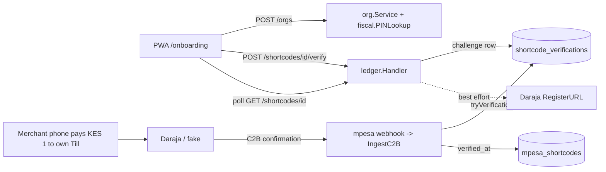

# Requirements

### Overview & Goals
Deliver `plan.md` §4.1 **Onboarding & shortcode verification** (first Phase‑1 item) end to end: a brand‑new user who logs in with OTP can create their business (KRA PIN checked through the fiscal provider), add the M‑Pesa Till/Paybill/Pochi they get paid on, and **prove control of it by paying KES 1 from their own phone to that number**. The PWA gets a three‑step onboarding screen and Settings gets "Add shortcode" / "Verify" actions. Everything is testable offline (fake Daraja, e2e stub) and is exercised once against the real Daraja sandbox with the credentials already in `.env`.

Decisions confirmed with you:
- **Control check = pay own Till** (C2B match by shortcode + payer MSISDN + KES 1 inside a 10‑min window), not an STK push.
- **Tests use an in‑process fake Daraja; one manual run against the real sandbox** (cloudflared tunnel, number `0140994513`).
- **KRA PIN lookup goes through the fiscal provider** (`mock` rejects a reserved test PIN; `vendor` calls the integrator; unavailable ⇒ org created with `kra_pin_verified_at: null`).

### Scope
**In scope**
- Backend: `POST /orgs` PIN lookup + `422 pin_unknown`; `POST /shortcodes` `409 shortcode_claimed`; `GET /shortcodes/{id}`; `POST /shortcodes/{id}/verify` → pending C2B challenge (202) / already verified (200) / `409 shortcode_claimed`; C2B ingest completes the challenge; best‑effort `RegisterURL`; `WEBHOOK_BASE_URL` config fix; migration `0002`.
- Backend tests with a fake Daraja (`httptest`) covering OAuth, RegisterURL, C2B simulate → webhook.
- Tooling: `ciftctl simulate-c2b` + `make sandbox-verify`, runbook procedure for the real sandbox.
- Web: `/onboarding` (3 steps), redirects for org‑less sessions, `ShortcodeForm` + `VerifyShortcode` reused in Settings, hooks, en/sw strings, Playwright spec + stub endpoints, vitest for helpers, Pixel‑5 screenshots for you.
- Docs/plan: `api/openapi.yaml`, `docs/ux-flows.md`, `docs/data-model.md`, `docs/runbooks/local-dev.md`, `plan.md` §4.1 ticks, `.junie` session plan.

**Out of scope**
- Real Africa's Talking OTP delivery (already implemented via `notify.Service`; sandbox account opening is §9.2), request‑to‑pay STK (Phase 2), admin ops UI for verifications, Fly deploy.

### User Stories
- As a duka owner logging in for the first time, I want to register my business and Till in under 3 minutes so that my next M‑Pesa payment already produces a KRA receipt.
- As a merchant, I want to prove the Till is mine by sending KES 1 to it from my own phone, because that is a step I already understand and it needs no PIN sharing.
- As a merchant whose Till was already claimed by someone else, I want a clear message so I can contact support instead of getting a generic error.
- As a merchant, I want to add or verify another shortcode later from Settings.
- As an operator, I want the whole flow covered by tests that do not hit Safaricom, plus a documented way to run it against the sandbox.

### Functional Requirements
1. `POST /orgs`: PIN format → `422 validation`; provider says unknown → `422 pin_unknown`; provider unavailable → 201 with `kra_pin_verified_at: null` (warn log); same PIN already registered → `409 conflict`. Caller becomes owner; first org is default.
2. `POST /shortcodes`: if another org already holds a **verified** row for the number → `409 shortcode_claimed`; otherwise 201 unverified row (duplicates across orgs allowed until one verifies).
3. `POST /shortcodes/{id}/verify` (body `{}` or `{msisdn}`): already verified → `200 {status:"verified", shortcode}`; claimed elsewhere → `409 shortcode_claimed`; otherwise create/refresh a pending challenge (10 min) and return `202 {status:"pending", msisdn_masked, pay: {kind, shortcode, amount_cents: 100, account_ref}, expires_at}`. With no Daraja credentials (`APP_ENV=local`, unconfigured) the shortcode is verified immediately (200) as today. Best‑effort `RegisterC2BURLs` runs when the challenge is created (sets `c2b_urls_registered_at`; failure only logged).
4. C2B confirmation for `{shortcode, msisdn, amount == 100}` with an open challenge → shortcode marked verified, challenge `verified` with `trans_id`, audit `shortcode.verified`, webhook event processed; **no payment/sale/invoice is created** for the KES 1. If the partial unique index says another org verified it first → challenge `failed` (`claimed`). Any other C2B on an unverified shortcode behaves exactly as today.
5. `GET /shortcodes/{id}` returns `Shortcode` plus `verification: {status: pending|verified|expired|failed, expires_at}` when a challenge exists, so the PWA can poll every 3 s.
6. Web `/onboarding`: requires session (→ `/login?next=/onboarding`); Step 1 business, Step 2 shortcode, Step 3 "Pay KES 1 to your own Till" with an instruction card (Lipa na M‑Pesa → Buy Goods/Pay Bill → number → KES 1), countdown, polling, success → "Go to Today"; "Do this later" and "Start again" (new challenge). Skips step 1 if an org exists; goes to `/today` if a verified shortcode exists. `LoginForm`/`AppShell` redirect org‑less sessions to `/onboarding`.
7. Settings: "Add shortcode" sheet and per‑row "Verify" using the same components; "C2B URLs registered" hint; invalidates `qk.shortcodes`.
8. All copy in `en.json` and `sw.json`, short and plain.

### Non‑Functional Requirements
- No money custody (ADR‑0003): the KES 1 goes merchant‑to‑merchant; CiftPay only observes the confirmation.
- Existing RLS model (ADR‑0007): the new table gets an org policy; the cross‑tenant read stays confined to `db.WithIngest`.
- Backend: `go build/vet/test ./...`, `golangci-lint` clean; Web: `tsc`, `eslint`, `vitest`, `make e2e` (mobile + desktop) green; `/r/<code>` stays zero‑JS.

# Technical Design

### Current Implementation
- `backend/internal/ledger/handler.go` mounts `GET/POST /shortcodes`, `PATCH /shortcodes/{id}`, `POST /shortcodes/{id}/verify`; **no `GET /shortcodes/{id}`**. `verifyShortcode` (l.228‑293) requires `{msisdn}` and does a KES 1 **STK push on the merchant's shortcode** with `h.PublicBaseURL` as callback base — wrong since `PUBLIC_BASE_URL` now points at the web app. `createShortcode` maps the partial‑unique violation to a 422, not `409 shortcode_claimed`.
- `backend/internal/ledger/stk.go` `IngestSTK` has a `purpose == "verify"` branch marking the shortcode verified (kept, now unused by verification).
- `backend/internal/ledger/service.go` `IngestC2B` → `ProcessStoredC2B` → `applyPayment` (Match → payment/cash sale/invoice/jobs).
- `backend/internal/org/service.go`: `PINChecker` interface, `FormatOnlyPINChecker` default (wired with `nil` in `cmd/api/main.go` l.91); `CreateOrg` sets `kra_pin_verified_at` when `verified`.
- `backend/internal/fiscal/provider.go` `Provider` interface + `mock`/`vendor` adapters; no taxpayer lookup.
- `backend/internal/mpesa/client.go`: OAuth token cache, `RegisterC2BURLs`, `STKPush`; `config.Daraja` has key/secret/shortcode/passkey/webhook token.
- `backend/db/queries/mpesa.sql` (`ResolveShortcode`, `MarkShortcodeVerified`, `CreateSTKRequest`…), single migration `0001_init.sql`.
- `api/openapi.yaml` already describes `GET /shortcodes/{id}`, `409 shortcode_claimed` and `422 pin_unknown`, but `ShortcodeVerification` is STK‑shaped (`checkout_request_id`) and `verifyShortcode` text says STK.
- Web: `web/src/lib/auth.ts` (`readSession/writeSession/useVerifyOtp/switchOrg`), `web/src/lib/api/client.ts` (`ApiRequestError{status, code}`, `setActiveOrgId`), `web/src/lib/api/queries.ts` (`qk`, `useShortcodes`, `useVerifyShortcode` stub), `LoginForm.tsx`, `shell/AppShell.tsx`, `(merchant)/settings/page.tsx`, `e2e/stub-api.mjs` route table `"METHOD /path"`. **No onboarding code exists yet** (the earlier delegated attempt produced nothing).

### Key Decisions
1. **Own‑Till C2B as the control proof** (your choice). Challenge = row in new table `shortcode_verifications`; matched in `applyPayment` *before* `Match()` so the KES 1 never becomes a sale/invoice. Rationale: real ownership proof, no PIN prompt, no passkey per merchant.
2. **No payment row for the verification KES 1.** The webhook event is stored/processed and the challenge keeps `trans_id`/`paid_at`; avoids a KES 1 "unmatched" item in Attention and an accidental KRA invoice. Trade‑off: money moved that is not in `payments`; documented in `docs/data-model.md`.
3. **Separate `WEBHOOK_BASE_URL`** (api's public URL, default `http://localhost:8080`) used by `RegisterC2BURLs`/`STKPush`; `PUBLIC_BASE_URL` stays the web app URL for receipt links. Fixes the regression from the last session.
4. **PIN lookup as an optional fiscal capability**: `fiscal.PINLookup` interface (`LookupPIN(ctx, pin) (Taxpayer, error)`; `ErrPINUnknown`, `ErrLookupUnavailable`). `org.PINChecker` becomes `CheckPIN(ctx, pin) error` and `CreateOrg` maps unknown → `ErrPINUnknown` (422 `pin_unknown`), unavailable → unverified. Mock: PINs ending in `…000000Z`‑style reserved value `P000000000Z` are unknown, others known. Vendor: `GET {VendorBaseURL}/taxpayers/{pin}` (path constant, easy to adjust to the integrator once chosen).
5. **Fake Daraja for tests** (`internal/mpesa/mpesatest`): `httptest.Server` with `/oauth/v1/generate`, `/mpesa/c2b/v1/registerurl` (records URLs), `/mpesa/c2b/v1/simulate` (POSTs a C2B confirmation to the registered ConfirmationURL). Used by handler/service tests and by `ciftctl simulate-c2b` when `DARAJA_BASE_URL` points at it.
6. **Polling, not push**, for the PWA (`GET /shortcodes/{id}` every 3 s, ≤10 min) — matches the existing contract and needs no websockets.

### Proposed Changes
**Contract & schema**
- `api/openapi.yaml`: rewrite `verifyShortcode` summary/description; `ShortcodeVerification` → `{status: pending|verified, msisdn_masked?, pay?: {kind, shortcode, amount_cents, account_ref}, expires_at?, shortcode?}`; `Shortcode` gains optional `verification: {status, expires_at}`; add `WEBHOOK_BASE_URL` to `.env.example`. Regenerate `web/src/lib/api/schema.d.ts` (`make gen`).
- `backend/db/migrations/0002_shortcode_verifications.sql`:
  ```sql
  CREATE TABLE shortcode_verifications (
    id uuid PK, org_id uuid NOT NULL REFERENCES orgs, shortcode_id uuid NOT NULL REFERENCES mpesa_shortcodes,
    msisdn_hash bytea NOT NULL, amount_cents bigint NOT NULL DEFAULT 100,
    status text NOT NULL DEFAULT 'pending' CHECK (status IN ('pending','verified','expired','failed')),
    trans_id text, paid_at timestamptz, expires_at timestamptz NOT NULL, created_at/updated_at ...);
  -- index (shortcode_id, msisdn_hash, status), RLS policy like stk_requests, updated_at trigger
  ```
- `backend/db/queries/mpesa.sql`: `CreateShortcodeVerification`, `LatestShortcodeVerification(shortcode_id)`, `FindOpenShortcodeVerification(shortcode_id, msisdn_hash, amount_cents)`, `SettleShortcodeVerification(id, status, trans_id, paid_at)`, `ExpireShortcodeVerifications`, `CountVerifiedShortcodeElsewhere(shortcode, org_id)`, `MarkShortcodeC2BRegistered(id)`.

**Backend**
- `internal/fiscal/provider.go` + `mock/`, `vendor/`: `PINLookup` capability, `Taxpayer{PIN, Name, VATRegistered}`.
- `internal/org/service.go`: `PINChecker` → error‑returning; `ErrPINUnknown` → handler `422 pin_unknown`; `fiscalPINChecker` adapter in `internal/org/pin.go`; `cmd/api/main.go` wires it.
- `internal/ledger/handler.go`: add `getShortcode`; `createShortcode` claimed check → `ErrShortcodeClaimed` (409); rewrite `verifyShortcode` per FR3 (msisdn from `GetUser` + `Keys.DecryptString`, optional override); `Handler` gets `Daraja` (interface: `Configured`, `RegisterC2BURLs`) and `WebhookBaseURL`.
- `internal/ledger/service.go` `applyPayment`: new first step `s.tryVerification(ctx, tx, sc, in, msisdnHash)`; when it consumes the event, skip payment creation, mark event processed, `res.Rule = "verification"`.
- `internal/ledger/errors.go`: `ErrShortcodeClaimed`; `fail()` maps to 409 `shortcode_claimed`.
- `internal/platform/config`: `WebhookBaseURL string env:"WEBHOOK_BASE_URL" envDefault:"http://localhost:8080"`; `docker-compose.yml` env for api/worker.
- `internal/mpesa/client.go`: `SimulateC2B(ctx, shortcode, msisdn, amountCents, billRef)` (sandbox‑only endpoint) used by ciftctl; `mpesatest` fake server.
- `cmd/ciftctl`: `simulate-c2b --shortcode --msisdn --amount` (real sandbox or fake); `Makefile` targets `sandbox-verify` and `daraja-fake`.

**Web**
- `web/src/lib/api/queries.ts`: `useCreateOrg` (in `auth.ts`, updates session copy + `setActiveOrgId`), `useCreateShortcode`, `useShortcode(id, {refetchInterval})`, `useVerifyShortcode` (returns `ShortcodeVerification`).
- `web/src/components/onboarding/`: `BusinessForm.tsx`, `ShortcodeForm.tsx`, `VerifyShortcode.tsx` (instruction card, countdown, polling, states pending/verified/expired/claimed), `StepIndicator.tsx`, `verify.ts` pure helpers (`payInstructions(kind, shortcode)`, `remainingSeconds`) + vitest.
- `web/src/app/(auth)/onboarding/page.tsx` + `OnboardingFlow.tsx` (client); `LoginForm.tsx` redirect; `AppShell.tsx` guard; `(merchant)/settings/page.tsx` sheet + row action.
- `web/messages/en.json`, `sw.json`: `onboarding.*`, `settings.shortcodes.*`.
- `web/e2e/stub-api.mjs`: `POST /orgs`, `POST /shortcodes` (incl. `shortcode_claimed` for number `999999`), `POST /shortcodes/:id/verify` (202), `GET /shortcodes/:id` (verified on 2nd poll); `web/e2e/onboarding.spec.ts`.

### Data Models / Contracts
```yaml
ShortcodeVerification:
  status: pending | verified
  msisdn_masked: "2541•••••513"
  pay: { kind: till, shortcode: "123456", amount_cents: 100, account_ref: "CIFTPAY" }
  expires_at: date-time
  shortcode: Shortcode        # when status = verified
Shortcode: + verification?: { status: pending|verified|expired|failed, expires_at }
```
```go
type PINLookup interface { LookupPIN(ctx context.Context, pin string) (Taxpayer, error) }
var ErrPINUnknown, ErrLookupUnavailable error
type Daraja interface { Configured() bool; RegisterC2BURLs(ctx, shortcode, webhookBaseURL string) error }
func (s *Service) tryVerification(ctx, tx db.Tx, sc gen.ResolveShortcodeRow, in C2BInput, msisdnHash []byte) (consumed bool, err error)
```

### File Structure
- Added: `backend/db/migrations/0002_shortcode_verifications.sql`, `backend/internal/org/pin.go`, `backend/internal/ledger/verification.go` (+`_test.go`), `backend/internal/mpesa/mpesatest/server.go`, `backend/internal/mpesa/client_test.go`, `web/src/components/onboarding/*`, `web/src/app/(auth)/onboarding/*`, `web/e2e/onboarding.spec.ts`.
- Modified: `api/openapi.yaml`, `.env.example`, `docker-compose.yml`, `Makefile`, `backend/db/queries/mpesa.sql`, `backend/internal/{fiscal,org,ledger,mpesa,platform/config}`, `backend/cmd/{api,ciftctl}`, `web/src/lib/{auth.ts,api/queries.ts}`, `LoginForm.tsx`, `AppShell.tsx`, `settings/page.tsx`, `web/messages/*.json`, `web/e2e/stub-api.mjs`, `docs/{ux-flows,data-model,api}.md`, `docs/runbooks/local-dev.md`, `plan.md`, `.junie/plans/...md`.

### Architecture Diagram


### Risks
- **Production RegisterURL needs the shortcode under CiftPay's Daraja app**; for third‑party Tills Safaricom requires a Go‑Live/partner arrangement. Mitigation: registration is best‑effort and surfaced via `c2b_urls_registered_at`; runbook documents the manual path; plan §9.2 already lists the Daraja account work.
- **Sandbox simulate may only accept Safaricom test MSISDNs**; if `254140994513` is rejected, the runbook records the fallback (use the test MSISDN, override via `{msisdn}` on verify).
- **Two orgs racing to verify one number**: the existing partial unique index is the arbiter; the loser's challenge becomes `failed` and the UI shows the claimed message.
- **Amount mismatch** (user pays KES 2): treated as a normal payment (unmatched) — instructions and UI say exactly KES 1.

# Testing

### Validation Approach
Unit + handler tests in Go against a `pgxpool` test DB (existing pattern) and the `mpesatest` fake Daraja; vitest for pure web helpers; Playwright against the e2e stub API (Pixel 5 + Desktop) via `make e2e`; one manual pass against the live Daraja sandbox through a cloudflared tunnel using `0140994513`; screenshots of every onboarding state saved to the session scratch dir and shown to you.

### Key Scenarios
- `POST /orgs` with mock provider: valid PIN → 201 with `kra_pin_verified_at` set; reserved `P000000000Z` → 422 `pin_unknown`; provider returning `ErrLookupUnavailable` → 201 with null; duplicate PIN → 409.
- `POST /shortcodes` when another org already verified the number → 409 `shortcode_claimed`; otherwise 201.
- `POST /shortcodes/{id}/verify` with credentials configured → 202 with `pay`, `expires_at`, masked MSISDN; RegisterURL recorded by the fake; without credentials → 200 verified.
- C2B confirmation (via fake `simulate` → webhook) `amount=1, msisdn=owner` → shortcode verified, challenge settled, **zero** `payments`/`sales`/`invoices` rows, webhook event processed; `GET /shortcodes/{id}` shows `verified: true`.
- Same confirmation from another MSISDN or amount 2 → today's behaviour (unmatched payment, challenge still pending).
- Playwright happy path: login → business → till → verify (202, polled to verified) → `/today`; `shortcode_claimed` path; Settings add‑shortcode sheet and row Verify.
- Real sandbox: `make sandbox-verify` completes a verification for the sandbox test shortcode; result and any deviation logged in the runbook.

### Edge Cases
- Challenge expired → `GET` shows `expired`; UI offers "Start again" which creates a fresh challenge (old one marked expired).
- Duplicate C2B TransID after verification → `ErrDuplicate`, no double audit.
- Session without orgs hitting any merchant route → redirected to `/onboarding`; onboarding with a verified shortcode → `/today`.
- Swahili locale renders all onboarding copy (no missing‑key fallbacks in console).
- Existing suites keep passing: Go `./...`, vitest 13+, Playwright 20 + new specs.

### Test Changes
- Add: `backend/internal/ledger/verification_test.go`, `backend/internal/org/service_pin_test.go`, `backend/internal/mpesa/client_test.go` (fake server), `web/src/components/onboarding/verify.test.ts`, `web/e2e/onboarding.spec.ts`.
- Update: `backend/internal/ledger/handler_test.go` (verify handler now C2B‑based), `web/e2e/stub-api.mjs`.
- Skip: no live‑network tests in CI.

# Delivery Steps

### ✓ Step 1: Update the API contract and database schema for C2B-based verification
`api/openapi.yaml`, migration `0002` and generated code describe the own-Till verification and PIN lookup outcomes.

- Rewrite `verifyShortcode` summary/description and the `ShortcodeVerification` schema (`status`, `msisdn_masked`, `pay {kind, shortcode, amount_cents, account_ref}`, `expires_at`, `shortcode`); add optional `verification {status, expires_at}` to `Shortcode`.
- Add `backend/db/migrations/0002_shortcode_verifications.sql` (table, index, RLS policy, `updated_at` trigger) and register it in `embed.go`.
- Add sqlc queries in `backend/db/queries/mpesa.sql` (`CreateShortcodeVerification`, `FindOpenShortcodeVerification`, `LatestShortcodeVerification`, `SettleShortcodeVerification`, `ExpireShortcodeVerifications`, `CountVerifiedShortcodeElsewhere`, `MarkShortcodeC2BRegistered`).
- Add `WEBHOOK_BASE_URL` to `config.Config`, `.env.example`, `docker-compose.yml` (api + worker).
- Run `make gen` (sqlc + `openapi-typescript`) and `make migrate`; `go build ./...` and `tsc --noEmit` clean.

### ✓ Step 2: Implement KRA PIN lookup through the fiscal provider
`POST /orgs` returns `422 pin_unknown` for unknown PINs, sets `kra_pin_verified_at` for known ones, and degrades to unverified when the checker is down.

- Add `fiscal.PINLookup` interface, `Taxpayer` struct, `ErrPINUnknown`, `ErrLookupUnavailable` in `backend/internal/fiscal/provider.go`.
- Implement in the mock adapter (reserved PIN `P000000000Z` → unknown; others known, deterministic name) and the vendor adapter (`GET {VendorBaseURL}/taxpayers/{pin}`, unavailable without base URL).
- Change `org.PINChecker` to `CheckPIN(ctx, pin) error`; add `internal/org/pin.go` adapter over `fiscal.Provider`; map `ErrPINUnknown` → 422 `pin_unknown` in `org/handler.go`; keep `FormatOnlyPINChecker` as fallback.
- Wire the adapter in `cmd/api/main.go`.
- Tests: `org/service_pin_test.go` (known / unknown / unavailable / duplicate) and a mock adapter test.

### ✓ Step 3: Implement own-Till shortcode verification in the ledger
A merchant paying KES 1 from their phone to their own shortcode marks it verified without creating a payment, and the API exposes challenge state.

- `ledger/handler.go`: add `GET /shortcodes/{id}` (with `verification`), return `409 shortcode_claimed` from `createShortcode` and `verifyShortcode`, rewrite `verifyShortcode` to create/refresh a 10-min challenge (MSISDN from the session user via `GetUser` + `Keys.DecryptString`, optional `{msisdn}` override), respond 202/200, and call best-effort `RegisterC2BURLs` using `WebhookBaseURL` (sets `c2b_urls_registered_at`).
- Add `ledger/verification.go` with `tryVerification` and call it first in `applyPayment`; on match settle the challenge, `MarkShortcodeVerified`, append audit, skip payment/sale creation, handle the partial-unique race as `failed`.
- Add `ErrShortcodeClaimed` mapping in `fail()`; pass `STKPush`/`RegisterURL` callbacks through `WebhookBaseURL` instead of `PublicBaseURL` in `mpesa/client.go` callers.
- Build `internal/mpesa/mpesatest` fake Daraja (`oauth`, `registerurl`, `simulate` → posts confirmation to the registered URL) and `mpesa/client_test.go`.
- Tests: `ledger/verification_test.go` (verify → 202, simulate → verified with zero payments; wrong MSISDN/amount → normal unmatched payment; claimed → 409; expired challenge), update `handler_test.go`; `go vet`/`golangci-lint` clean.

### ✓ Step 4: Add sandbox tooling and run the live Daraja sandbox check
The verification loop can be driven from the CLI against the fake or the real sandbox, and one real run is documented.

- Add `ciftctl simulate-c2b --shortcode --msisdn --amount --ref` using `mpesa.Client.SimulateC2B` (new method, sandbox-only endpoint).
- Add `Makefile` targets `daraja-fake` (runs the fake server on `:18090`) and `sandbox-verify` (tunnel hint + simulate).
- Document in `docs/runbooks/local-dev.md`: start `cloudflared tunnel --url http://localhost:8080`, set `WEBHOOK_BASE_URL`, register URLs for the sandbox test shortcode, create org/shortcode/verify with `0140994513`, simulate, observe `verified_at`.
- Execute the run once with the credentials in `.env`; log the outcome (including whether the sandbox accepts a non-test MSISDN) as deviation entries.

### ✓ Step 5: Build the onboarding flow in the PWA
A new user goes login → business → shortcode → pay-KES-1 verification → `/today` in one screen.

- Add hooks: `useCreateOrg` (`auth.ts`: `writeSession` + `setActiveOrgId`), `useCreateShortcode`, `useShortcode(id, poll)`, updated `useVerifyShortcode` in `queries.ts`.
- Add `web/src/components/onboarding/{StepIndicator,BusinessForm,ShortcodeForm,VerifyShortcode}.tsx` and `verify.ts` helpers (`payInstructions`, `remainingSeconds`) with vitest.
- Add `web/src/app/(auth)/onboarding/page.tsx` + `OnboardingFlow.tsx` (session guard, skip logic, `pin_unknown`/`conflict`/`shortcode_claimed` messages, countdown + 3 s polling, expired → start again, "Do this later").
- Redirect org-less sessions in `LoginForm.tsx` and `shell/AppShell.tsx`.
- Add `onboarding.*` strings to `web/messages/en.json` and `sw.json`.

###   Step 6: Integrate shortcode management into Settings and cover with e2e
Settings can add and verify shortcodes with the same components, and Playwright proves the whole flow against the stub.

- `(merchant)/settings/page.tsx`: "Add shortcode" `Sheet` with `ShortcodeForm` → `VerifyShortcode`, per-row "Verify" for unverified rows, "C2B URLs registered" hint, `qk.shortcodes` invalidation.
- Extend `web/e2e/stub-api.mjs` with `POST /orgs`, `POST /shortcodes` (409 for `999999`), `POST /shortcodes/:id/verify` (202), `GET /shortcodes/:id` (verified on second poll).
- Add `web/e2e/onboarding.spec.ts` (happy path, claimed path, settings sheet) and run `npx tsc --noEmit`, `npm run lint`, `npx vitest run`, `npm run build`, `make e2e`.
- Capture Pixel-5 screenshots of each onboarding step, expired/claimed states and the settings sheet into the session scratch dir and show them.

###   Step 7: Close out §4.1 in docs and plans
Documentation reflects the shipped behaviour and `plan.md` §4.1 is ticked.

- Update `docs/ux-flows.md` (onboarding flow), `docs/data-model.md` (`shortcode_verifications`, no-payment rule), `docs/api.md` (verification contract, `WEBHOOK_BASE_URL`).
- Record deviations in `docs/runbooks/local-dev.md` (STK → C2B decision, sandbox findings, RegisterURL production caveat).
- Tick `plan.md` §4.1 items and add a Phase-1 step entry in `.junie/plans/ciftpay-etims-compliance-rail-plan.md`; note the next unticked item (§4.2).