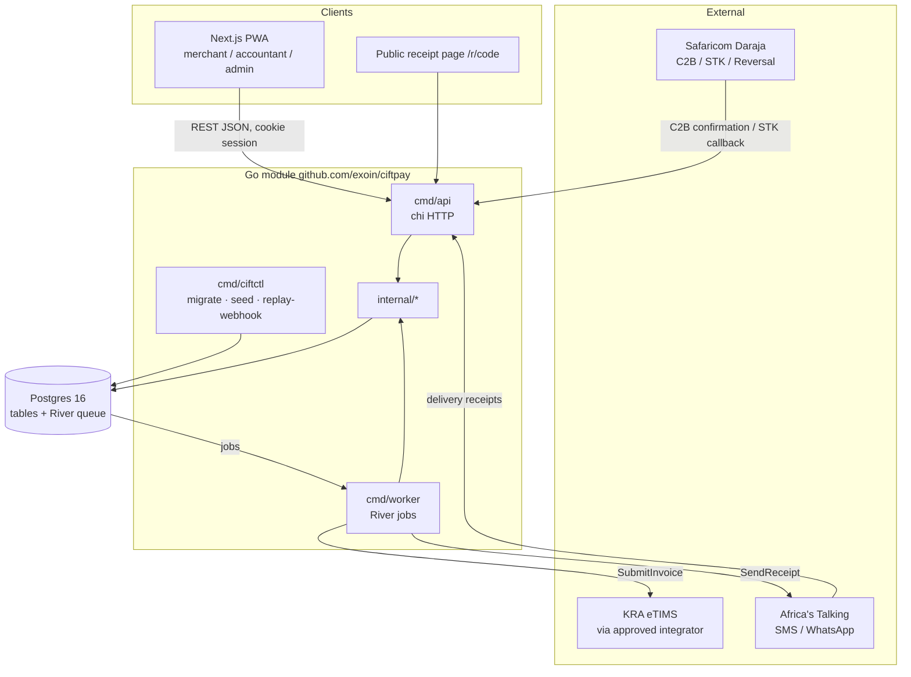

# CiftPay — Architecture

Status: Phase 0. Decisions are recorded in [`adr/`](adr/). This document describes *how the system is shaped*; [`data-model.md`](data-model.md) describes *what it stores*; [`api.md`](api.md) describes *what it exposes*.

## 1. Shape: modular monolith + worker



One Go module, three binaries, one database. `api` is latency-sensitive (webhooks must answer Daraja within seconds), `worker` is throughput-and-retry-sensitive (KRA calls can take seconds and fail). They scale independently but share code and the database. No message broker: River stores jobs in Postgres so a payment row and its `SubmitInvoice` job are committed in one transaction ([ADR-0004](adr/0004-river-postgres-queue.md)).

## 2. Packages

```
backend/
├── cmd/
│   ├── api/        HTTP server: router, middleware, handlers from internal/*
│   ├── worker/     River client + workers: SubmitInvoice, SendReceipt, ReconcilePayments
│   └── ciftctl/    dev/ops CLI: migrate, seed, replay-webhook <file>
├── internal/
│   ├── platform/
│   │   ├── config/   env → Config struct (caarlos0/env), validation, defaults
│   │   ├── db/       pgx pool, WithOrg(ctx, orgID) → tx with SET LOCAL app.org_id, sqlc-generated code
│   │   ├── httpx/    chi middleware: request-id, slog logging, recoverer, auth (session cookie), RLS scoping, rate limit, JSON helpers + error envelope
│   │   ├── jobs/     River client construction, job arg types, queue names, retry policy
│   │   ├── log/      slog JSON handler, PII-safe field helpers
│   │   └── crypto/   envelope encryption (AES-256-GCM data key wrapped by master key), keyed hash (HMAC-SHA256) for lookups
│   ├── org/          orgs, users, memberships, roles, phone-OTP, sessions
│   ├── mpesa/        Daraja client (OAuth token cache, RegisterURL, STK push, TransactionStatus), webhook handlers, payload types, testdata/
│   ├── ledger/       payments, sales, sale_items, customers; Matcher; reversal → credit note
│   ├── fiscal/       Provider port, Invoice/Ack types, state machine, tax categories, retry classification
│   │   ├── oscu/         Direct KRA OSCU system-to-system client (ADR-0009, ADR-0011)
│   │   ├── mock/         deterministic acks; failure injection
│   │   ├── vendor/       KRA-approved integrator HTTP adapter (stub in Phase 0)
│   │   └── providertest/ contract suite every adapter must pass
│   ├── notify/       templates (EN/SW), Africa's Talking sender, delivery receipt handler
│   ├── billing/      plans, subscriptions, usage counters, overage
│   ├── reports/      VAT position, return pack, P&L
│   ├── publicapi/    GET /r/{code} (no auth)
│   └── admin/        org search, dead-letter queue, feature flags
├── db/
│   ├── migrations/   goose SQL migrations (0001_init.sql …)
│   └── queries/      sqlc query files, one per aggregate
├── sqlc.yaml
└── Dockerfile
```

### Dependency rules
- `internal/platform/*` depends on nothing else in `internal/`.
- Domain packages (`org`, `mpesa`, `ledger`, `fiscal`, `notify`, `billing`, `reports`, `publicapi`, `admin`) depend on `platform` and may depend on each other only through **interfaces defined by the consumer** (e.g. `ledger` defines `InvoiceEnqueuer`; `fiscal` implements it). No import cycles; `go vet` + `depguard` in `.golangci.yml`.
- `cmd/*` is the only place where concrete implementations are wired together.
- `fiscal/mock`, `fiscal/vendor` depend on `fiscal`, never the other way round.

### Package boundaries in one sentence each
| Package | Owns | Never does |
|---|---|---|
| `mpesa` | Talking to Daraja; turning raw callbacks into stored `webhook_events` and normalised `PaymentEvent`s | Business matching; fiscal logic |
| `ledger` | Payments, sales, matching, money maths | HTTP to external systems |
| `fiscal` | Invoice lifecycle and KRA semantics; adapter selection | Deciding *what* was sold |
| `notify` | Rendering and sending messages; delivery status | Deciding *when* to notify (worker does) |
| `org` | Identity, tenancy, roles | Anything money-related |

## 3. Request flows

### 3.1 C2B confirmation → ACKED invoice → receipt

```mermaid
sequenceDiagram
  participant D as Daraja
  participant A as api (mpesa.Webhook)
  participant L as ledger.Service
  participant PG as Postgres
  participant W as worker
  participant F as fiscal.Provider
  participant N as notify (Africa's Talking)

  D->>A: POST /webhooks/daraja/c2b/confirmation/{token}
  A->>A: verify token + IP allow-list
  A->>PG: INSERT webhook_events (external_id = mpesa:TransID) ON CONFLICT DO NOTHING
  alt duplicate
    A-->>D: 200 {"ResultCode":0}
  else new
    A->>L: HandlePayment(PaymentEvent)
    L->>PG: BEGIN; SET LOCAL app.org_id
    L->>PG: INSERT payments (trans_id UNIQUE)
    L->>L: Match(): BillRef → open sale | STK window | cash sale | unmatched
    L->>PG: INSERT/UPDATE sales, sale_items
    L->>PG: INSERT invoices (state=QUEUED, receipt_code)
    L->>PG: river.InsertTx(SubmitInvoice{invoice_id})
    L->>PG: COMMIT
    A-->>D: 200 {"ResultCode":0,"ResultDesc":"Accepted"}
  end
  PG-->>W: job SubmitInvoice
  W->>PG: state QUEUED → SUBMITTED; INSERT fiscal_submissions(attempt)
  W->>F: SubmitInvoice(inv)
  alt ack
    F-->>W: Ack{KRAInvoiceNo, Signature, QR}
    W->>PG: state → ACKED; audit_log; INSERT job SendReceipt
  else retryable error
    W->>PG: state → FAILED_RETRYABLE → QUEUED (River snooze with backoff)
  else terminal error
    W->>PG: state → FAILED_TERMINAL → NEEDS_REVIEW; audit_log
  end
  PG-->>W: job SendReceipt
  W->>N: SMS "Receipt KES 2,400 from Wanjiru Groceries: https://ciftpay.co.ke/r/7KQ2M"
  W->>PG: INSERT notifications
```

Daraja must receive a `200` quickly; everything after the `webhook_events` insert is bounded by one DB transaction (no external calls) so p99 stays low.

### 3.2 Merchant API request
1. `httpx.RequestID` → `httpx.Logger` → `httpx.Recoverer`.
2. `httpx.Auth`: reads session cookie, loads `users`/`memberships`; resolves active `org_id` from `X-Org-Id` header (must be a membership) or the default membership.
3. `httpx.Scope`: opens a transaction, `SET LOCAL app.org_id = $1`, `SET LOCAL ROLE ciftpay_app`, attaches to context. Handlers use `db.FromCtx(ctx)`.
4. Handler → service → sqlc queries. Commit on 2xx, rollback otherwise.
5. Errors serialised via the envelope in [`api.md`](api.md).

### 3.3 Public receipt `/r/{code}`
No auth; `publicapi` runs with a dedicated `ciftpay_public` role whose RLS policy allows `SELECT` on `invoices`/`sale_items`/`orgs` by `receipt_code` only. Response cached 60 s at the edge. The Next.js route `r/[code]` server-renders from this JSON.

### 3.4 Worker job scoping
Each job carries `org_id`; the worker opens a tx with `SET LOCAL app.org_id` before touching tenant tables. Same RLS guarantees as the API.

## 4. Fiscal port

```go
package fiscal

type Provider interface {
    RegisterDevice(ctx context.Context, org OrgFiscalProfile) (DeviceRef, error)
    SubmitInvoice(ctx context.Context, inv Invoice) (Ack, error)     // idempotent by inv.ID
    SubmitCreditNote(ctx context.Context, cn CreditNote) (Ack, error)
    LookupItemCodes(ctx context.Context, q string) ([]ItemCode, error)
    Health(ctx context.Context) error
}

type Ack struct {
    KRAInvoiceNo string
    Signature    string
    QRPayload    string
    ReceivedAt   time.Time
    Raw          json.RawMessage
}
```

Adapters are selected by `FISCAL_ADAPTER` (`mock` | `vendor` | `oscu`) in `cmd/worker`. Errors are classified with `fiscal.Classify(err)` into `Retryable` (network, 5xx, 429, timeout) or `Terminal` (`*fiscal.ValidationError` — bad item code, bad PIN, duplicate). Every adapter must pass `providertest.Run(t, newProvider)` which checks idempotency, ack shape, validation-error classification and health.

### Invoice state machine
```
DRAFT ──enqueue──▶ QUEUED ──worker picks──▶ SUBMITTED ──ack──▶ ACKED
                     ▲                          │
                     │ backoff 2^n·15s (n≤8)    ├──retryable──▶ FAILED_RETRYABLE ─┘
                     │                          └──terminal───▶ FAILED_TERMINAL ──▶ NEEDS_REVIEW
                     └───────── retry (merchant/admin) ───────────────────────────────┘
ACKED + reversal / void ──▶ new invoice kind=CREDIT_NOTE, parent_invoice_id, same machine
```
Transitions are enforced in `fiscal.Transition(from, to)`; illegal moves return `ErrIllegalTransition`. The table `fiscal_submissions` records every attempt with request/response payloads for audit and vendor disputes.

## 5. Matching engine (`ledger.Matcher`)

Input: normalised `PaymentEvent{OrgID, ShortcodeID, TransID, AmountCents, MSISDNHash, BillRef, PaidAt}`.

| Order | Rule | Result |
|---|---|---|
| 1 | `BillRef` equals an open `sales.ref` for the org (case-insensitive, trimmed) and amount ≥ sale total | `MatchedSale` → sale `paid`; invoice from sale items |
| 2 | Amount equals a pending STK request for the same `msisdn_hash` created ≤ 10 min ago | `MatchedSTK` → same as above |
| 3 | Shortcode has `auto_invoice = true` and a `default_item_id` | `CashSale` → new sale with one line = default item, qty 1, price = amount (tax category from item) |
| 4 | Otherwise | `Unmatched` → `payments.status = 'unmatched'`; appears in Needs attention |

Partial payments (amount < sale total) are recorded against the sale but do not close it and do not fiscalise until fully paid (Phase 2 decides on partial invoices). Overpayments close the sale and fiscalise the sale total; the difference is flagged.

## 6. Retry, idempotency and time

- **Webhooks:** `webhook_events.external_id` unique; duplicate delivery returns `200` with no side effects. Daraja expects `{"ResultCode":0,"ResultDesc":"Accepted"}`.
- **Payments:** `payments.trans_id` unique — belt and braces with the above.
- **Jobs:** River unique-by-args on `invoice_id`; a crashed worker's job is re-leased. `SubmitInvoice` re-reads state and is a no-op if already `ACKED`.
- **Provider:** `SubmitInvoice` is idempotent by `inv.ID`; the vendor adapter sends `inv.ID` as the client reference and treats "duplicate" responses as success by fetching the existing ack.
- **Backoff:** `15s, 30s, 60s, 2m, 4m, 8m, 16m, 32m` (8 attempts ≈ 1 h) then `NEEDS_REVIEW`.
- **Time:** all timestamps `timestamptz` in UTC; reports use `Africa/Nairobi` for period boundaries. Daraja `TransTime` (`YYYYMMDDHHmmss`, EAT) is parsed with the Nairobi location.

## 7. Security architecture (summary)
- Phone OTP → session (`sessions` table, 30-day sliding, HttpOnly, `SameSite=Lax`, `Secure` outside dev). CSRF double-submit token for non-GET.
- Webhooks: path token (`DARAJA_WEBHOOK_TOKEN`) + Safaricom IP allow-list (configurable, off in dev); Africa's Talking delivery callback uses a shared secret header.
- PII: `crypto.Encrypt` returns `enc = base64(nonce‖ciphertext‖wrappedDEK)`; `crypto.Hash(msisdn)` = HMAC-SHA256 with a separate key for equality lookups. Plaintext MSISDN/PIN never hit logs (`log.Redact`).
- Roles: `ciftpay_owner` (migrations), `ciftpay_app` (RLS-enforced), `ciftpay_public` (receipt lookup).
- Audit: `audit_log(org_id, actor, action, entity, entity_id, before, after, at)` append-only.

Full detail: [`compliance.md`](compliance.md), [`data-model.md`](data-model.md), [`../plan.md §8`](../plan.md#8-cross-cutting-concerns).

## 8. Frontend architecture

- Next.js 15 App Router, TypeScript strict, Tailwind v4 with tokens from `src/styles/tokens.css`.
- Data: TanStack Query over an `openapi-fetch` client typed by `openapi-typescript` output (`src/lib/api/schema.d.ts`, generated by `make gen`).
- Route groups: `(auth)`, `(merchant)`, `(accountant)`, `(admin)` each with their own `layout.tsx`; `r/[code]` is outside the shell and server-rendered only.
- PWA: Serwist service worker; app shell precached; API responses network-first with short cache; "Record a sale" mutations queued in IndexedDB when offline.
- i18n: `next-intl`, locale from cookie, `messages/en.json` and `messages/sw.json`; CI checks key parity.

## 9. Deployment topology (Fly.io, Phase 1)
- `ciftpay-api` (2 × shared-cpu-1x, `nbo` region unavailable → `jnb` Johannesburg for latency to Kenya), `ciftpay-worker` (1×, scale by queue depth), `ciftpay-web` (1×), Fly Postgres 16 (HA pair).
- Release command: `ciftctl migrate`.
- Secrets via `fly secrets`; never in images.

## 10. Observability
- `slog` JSON to stdout with `request_id`, `org_id`, `job_id`, `trans_id`.
- OpenTelemetry: `otelhttp` on server and outbound clients, `otelpgx`; exporter OTLP (local collector in compose, Grafana Cloud/Honeycomb later).
- Health: `GET /healthz` checks DB ping and River queue table reachability; `GET /readyz` for rollout gating.
