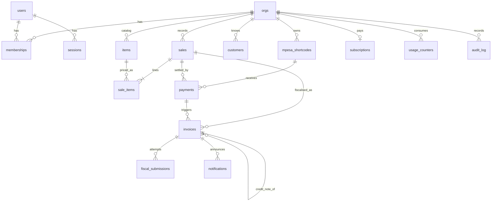

# CiftPay — Data Model

Postgres 16. Migrations in `backend/db/migrations/` (goose, plain SQL). Queries in `backend/db/queries/` (sqlc). Conventions:

- Primary keys: `uuid` (`gen_random_uuid()`), never sequential in public URLs.
- Money: `bigint` **cents** (KES has cents; Daraja sends whole shillings, stored ×100). Never `float`/`numeric` for balances. See [ADR-0005](adr/0005-sqlc-no-orm.md).
- Time: `timestamptz`, UTC. Report boundaries computed in `Africa/Nairobi`.
- Every tenant table has `org_id uuid NOT NULL REFERENCES orgs(id)` and RLS. Non-tenant tables: `orgs`, `users`, `webhook_events`, `plans`, River tables.
- Soft facts about people (MSISDN, KRA PIN) are stored twice: `*_enc bytea` (envelope-encrypted) and `*_hash bytea` (HMAC-SHA256, for equality lookups). Plaintext never persisted.
- `created_at timestamptz NOT NULL DEFAULT now()`, `updated_at` maintained by trigger `set_updated_at()` on every mutable table.

## 1. Entity overview



## 2. Tables

### Identity & tenancy

**`orgs`**
| column | type | notes |
|---|---|---|
| id | uuid PK | |
| name | text | trading name printed on receipts |
| kra_pin_enc | bytea | envelope-encrypted KRA PIN |
| kra_pin_hash | bytea UNIQUE | HMAC for uniqueness/lookup |
| kra_pin_verified_at | timestamptz | iTax PIN-checker lookup |
| vat_registered | boolean | drives default tax category (B vs D) |
| fiscal_profile | jsonb | `{"adapter":"vendor","device_ref":"...","branch_id":"00"}` |
| locale | text | `en` / `sw` |
| status | text | `active` / `suspended` |

**`users`**: `id`, `msisdn_enc`, `msisdn_hash UNIQUE`, `name`, `locale`, `last_login_at`.

**`memberships`**: `id`, `org_id`, `user_id`, `role` (`owner` / `staff` / `accountant` / `admin`), `is_default boolean`, UNIQUE(`org_id`,`user_id`).

**`sessions`**: `id`, `user_id`, `token_hash bytea UNIQUE`, `csrf_token`, `expires_at`, `revoked_at`, `user_agent`, `ip`.

**`otp_codes`**: `id`, `msisdn_hash`, `code_hash`, `expires_at`, `attempts int`, `consumed_at`. Index on (`msisdn_hash`, `expires_at`).

### M-Pesa

**`mpesa_shortcodes`**
| column | type | notes |
|---|---|---|
| id | uuid PK | |
| org_id | uuid | RLS |
| kind | text | `till` / `paybill` / `pochi` |
| shortcode | text | UNIQUE **among verified rows** (partial unique index `WHERE status = 'verified'`); several orgs may hold pending rows for one number |
| label | text | "Main till" |
| default_item_id | uuid → items | used for cash sales |
| auto_invoice | boolean DEFAULT true | fallback to cash sale |
| status | text | `pending_authorization` (default) / `verified` / `rejected` — the Administrative Gate ([ADR-0008](adr/0008-administrative-gate.md)) |
| verified_at | timestamptz | set iff `status = 'verified'` (CHECK); written only by an operator (`PATCH /admin/shortcodes/{id}/verify`, `ciftctl verify-shortcode`, seed) |
| authorization_letter_path | text | storage key of the uploaded signed Safaricom authorization letter under `UPLOAD_DIR` (`authorizations/<org>/<shortcode-id>.<ext>`); never a URL |
| authorization_submitted_at | timestamptz | last upload |
| reviewed_by / reviewed_at | text / timestamptz | admin user id or `ciftctl`; last decision |
| rejection_reason | text | shown to the merchant while `rejected`; cleared by a new upload |
| c2b_urls_registered_at | timestamptz | Daraja RegisterURL done (best effort, when the operator verifies) |

Migration `0003` dropped `shortcode_verifications` and `verification_checkout_id` (the 2026-09-08 own-Till KES 1 check). RLS: tenant policy plus `SELECT` under `app.scope = 'ingest'` (resolve a callback to its org) and `app.scope = 'admin'` (operator queue, `db.WithAdmin`); all writes happen under the owning org so audit rows land in that tenant.

**Rule — the ingest gate.** `ResolveShortcode` matches `BusinessShortCode` only against `status = 'verified'` rows. A C2B confirmation for any other number is stored in `webhook_events`, marked processed with `error = 'no verified shortcode <n>'`, acknowledged with 200, and creates **no `payments`, `sales` or `invoices` row**. Nothing reaches a tax ledger before Safaricom has confirmed who owns the Till.

**`webhook_events`** (not tenant-scoped; raw intake, kept 13 months)
| column | type | notes |
|---|---|---|
| id | uuid PK | |
| provider | text | `mpesa` / `at` |
| kind | text | `c2b_validation` / `c2b_confirmation` / `stk_callback` / `reversal` / `at_delivery` |
| external_id | text UNIQUE | `mpesa:<TransID>`; for STK `mpesa:stk:<CheckoutRequestID>` |
| payload | jsonb | verbatim |
| received_at | timestamptz | |
| processed_at | timestamptz | null until handled |
| error | text | last processing error |

**`stk_requests`**: `id`, `org_id`, `sale_id`, `shortcode_id`, `msisdn_hash`, `amount_cents`, `checkout_request_id UNIQUE`, `merchant_request_id`, `status` (`pending`/`success`/`failed`/`expired`), `result_code`, `result_desc`, `expires_at`.

### Ledger

**`payments`**
| column | type | notes |
|---|---|---|
| id | uuid PK | |
| org_id | uuid | RLS |
| shortcode_id | uuid → mpesa_shortcodes | |
| webhook_event_id | uuid → webhook_events | provenance |
| trans_id | text UNIQUE | Daraja `TransID` |
| amount_cents | bigint | |
| msisdn_enc | bytea | payer |
| msisdn_hash | bytea | index for STK window matching |
| payer_name | text | Daraja First/Middle/Last (may be blank) |
| bill_ref | text | `BillRefNumber` trimmed |
| paid_at | timestamptz | from `TransTime` (EAT) |
| status | text | `matched` / `cash_sale` / `unmatched` / `reversed` / `partial` |
| sale_id | uuid → sales | null when unmatched |
| match_rule | text | `bill_ref` / `stk_window` / `auto_invoice` / `manual` |

**`items`**: `id`, `org_id`, `name`, `etims_class_code text` (KRA item classification), `tax_category char(1)` (`A`/`B`/`C`/`D`/`E`), `unit text` (`PCS`, `KG`, …), `price_cents bigint`, `is_active boolean`. Index (`org_id`, `is_active`).

**`customers`**: `id`, `org_id`, `name`, `msisdn_enc`, `msisdn_hash`, `kra_pin_enc`, `kra_pin_hash`, UNIQUE(`org_id`,`kra_pin_hash`) where not null.

**`sales`**
| column | type | notes |
|---|---|---|
| id | uuid PK | |
| org_id | uuid | RLS |
| ref | text | human ref for BillRef, e.g. `CP-7KQ2M`; UNIQUE(`org_id`, `ref`) |
| kind | text | `open` (request-to-pay) / `cash` (created from a payment) |
| status | text | `open` / `paid` / `void` |
| customer_id | uuid → customers | nullable |
| subtotal_cents, tax_cents, total_cents | bigint | derived from lines, stored for speed |
| created_by | uuid → users | null for system |
| paid_at | timestamptz | |

**`sale_items`**: `id`, `org_id`, `sale_id`, `item_id`, `description`, `qty numeric(12,3)`, `unit_price_cents bigint`, `tax_category`, `tax_rate_bp int` (basis points: 1600, 800, 0), `line_total_cents`, `line_tax_cents`.

### Fiscal

**`invoices`**
| column | type | notes |
|---|---|---|
| id | uuid PK | also the provider idempotency key |
| org_id | uuid | RLS |
| sale_id | uuid → sales | |
| payment_id | uuid → payments | nullable (manual sale) |
| kind | text | `INVOICE` / `CREDIT_NOTE` |
| parent_invoice_id | uuid → invoices | for credit notes |
| state | text | `DRAFT` / `QUEUED` / `SUBMITTED` / `ACKED` / `FAILED_RETRYABLE` / `FAILED_TERMINAL` / `NEEDS_REVIEW` |
| attempt | int | current attempt number |
| next_attempt_at | timestamptz | |
| buyer_pin_enc / buyer_pin_hash | bytea | optional |
| kra_invoice_no | text | from ack |
| kra_signature | text | |
| kra_qr_payload | text | |
| receipt_code | text UNIQUE | 6-char Crockford base32, e.g. `7KQ2M9` |
| subtotal_cents, tax_cents, total_cents | bigint | frozen at submission |
| submitted_at, acked_at | timestamptz | |
| last_error | text | |

Indexes: (`org_id`, `state`), (`org_id`, `acked_at DESC`), (`state`, `next_attempt_at`) for the worker.

**`fiscal_submissions`**: `id`, `org_id`, `invoice_id`, `attempt`, `adapter`, `request jsonb`, `response jsonb`, `error text`, `classification` (`ok`/`retryable`/`terminal`), `started_at`, `finished_at`. Append-only.

### Notifications, billing, audit

**`notifications`**: `id`, `org_id`, `invoice_id`, `channel` (`sms`/`whatsapp`), `to_msisdn_enc`, `to_msisdn_hash`, `template`, `locale`, `body`, `provider_message_id`, `status` (`queued`/`sent`/`delivered`/`failed`), `cost_cents`, `sent_at`, `delivered_at`.

**`plans`** (reference): `code` PK (`hustler`/`duka`/`biashara`/`accountant`), `price_cents_monthly`, `invoice_cap`, `overage_cents`, `features jsonb`.

**`subscriptions`**: `id`, `org_id UNIQUE`, `plan_code`, `status` (`trial`/`active`/`past_due`/`cancelled`), `period_start`, `period_end`, `grace_until`.

**`usage_counters`**: `org_id`, `period` (`YYYY-MM`), `invoices_acked int`, `sms_sent int`, `whatsapp_sent int`; PK (`org_id`, `period`).

**`audit_log`**: `id bigserial`, `org_id`, `actor_type` (`user`/`system`/`admin`), `actor_id`, `action` (`invoice.submit`, `invoice.ack`, `invoice.fail`, `invoice.retry`, `credit_note.create`, `receipt.resend`, `shortcode.verify`, …), `entity`, `entity_id`, `before jsonb`, `after jsonb`, `at`. Append-only: `REVOKE UPDATE, DELETE` from every role.

**`feature_flags`**: `key` PK, `enabled boolean`, `org_allowlist uuid[]`.

## 3. Row-Level Security

See [ADR-0007](adr/0007-rls-multitenancy.md).

```sql
-- roles
CREATE ROLE ciftpay_owner  LOGIN;            -- migrations, owns tables
CREATE ROLE ciftpay_app    LOGIN;            -- api + worker
CREATE ROLE ciftpay_public LOGIN;            -- receipt lookups only

-- per tenant table
ALTER TABLE payments ENABLE ROW LEVEL SECURITY;
ALTER TABLE payments FORCE  ROW LEVEL SECURITY;
CREATE POLICY payments_tenant ON payments
  USING (org_id = current_setting('app.org_id', true)::uuid)
  WITH CHECK (org_id = current_setting('app.org_id', true)::uuid);
GRANT SELECT, INSERT, UPDATE ON payments TO ciftpay_app;
```

- The application always runs `SET LOCAL app.org_id = '<uuid>'` inside a transaction (`db.WithOrg`). With no setting, `current_setting(..., true)` returns `NULL` and every policy evaluates false → zero rows.
- `ciftpay_app` is **not** the table owner and has no `BYPASSRLS`.
- Cross-org reads for accountants are done as N scoped transactions (one per client org), never by disabling RLS.
- `ciftpay_public` has `SELECT` on a view `public_receipts` (invoice + org name + lines, filtered `state = 'ACKED' OR state = 'SUBMITTED'`) with a policy `USING (receipt_code = current_setting('app.receipt_code', true))`.
- **Scoped policies beyond `org_id`** (as shipped in `0001_init.sql`). Two request kinds carry no org at all, so a second setting, `app.scope` (`current_scope()`), and a third, `app.receipt_code` (`current_receipt_code()`), gate narrowly targeted extra policies:

  | Table | Policy | Scope | Why |
  |---|---|---|---|
  | `mpesa_shortcodes` | `mpesa_shortcodes_ingest` (`SELECT`) | `app.scope = 'ingest'` | A Daraja C2B callback must resolve `BusinessShortCode` → `org_id` *before* an org is known. |
  | `stk_requests` | `stk_requests_ingest` (`SELECT`) | `app.scope = 'ingest'` | STK callbacks carry only `CheckoutRequestID`. |
  | `notifications` | `notifications_delivery` (`UPDATE`) | `app.scope = 'ingest'` | Africa's Talking delivery reports carry only the provider message id. |
  | `invoices`, `sales`, `sale_items` | `*_public_receipt` (`SELECT`) | `receipt_code = app.receipt_code` | `/r/{code}` joins invoice → sale → lines for one receipt, no org. |

  Ingest-scope transactions are opened only by the webhook handlers (`db.WithIngest`), receipt-scope ones only by `/r/{code}` (`db.WithReceipt`); user-facing requests always use `db.WithOrg`. Once a webhook has resolved its org, the handler continues inside a normal `WithOrg` transaction.
- Integration test (`internal/platform/db/rls_test.go`): insert under org A, select under org B → 0 rows; select with no setting → 0 rows.

## 4. Encryption

`internal/platform/crypto`:

- Master key `MASTER_KEY_B64` (32 bytes). Per-record data key (DEK) generated, used for AES-256-GCM of the plaintext, then wrapped with the master key (AES-256-GCM). Stored blob: `version(1) ‖ nonce(12) ‖ wrappedDEK(60) ‖ nonce(12) ‖ ciphertext`. Version byte enables master-key rotation (re-wrap DEKs without touching ciphertext).
- Lookup hash: `HMAC-SHA256(HASH_KEY, normalised plaintext)`; MSISDN normalised to `2547XXXXXXXX`, PIN upper-cased.
- Fields: `orgs.kra_pin_*`, `users.msisdn_*`, `payments.msisdn_*`, `customers.msisdn_*`, `customers.kra_pin_*`, `invoices.buyer_pin_*`, `notifications.to_msisdn_*`.
- Never decrypt in list endpoints; detail endpoints return masked values (`2547•••••123`) unless the caller has `owner` role and asks explicitly.

## 5. Money & tax maths

- `tax_rate_bp` by category: A 0 (exempt), B 1600, C 0 (zero-rated export), D 0 (non-VAT), E 800.
- Prices are **VAT-inclusive** (Kenyan retail convention). For a line: `line_total = qty × unit_price`; `line_tax = round_half_even(line_total × rate / (10000 + rate))`. Invoice totals are sums of line values (no re-rounding).
- Cash sales from a payment: one line, `qty = 1`, `unit_price = amount_cents`.
- Credit notes carry negative totals and reference `parent_invoice_id`.

## 6. Retention

| Data | Retention | Basis |
|---|---|---|
| Invoices, sale lines, fiscal submissions, audit log | 7 years | KRA record-keeping (Tax Procedures Act) |
| `webhook_events.payload` | 13 months, then payload nulled (row kept) | debugging / reconciliation |
| `otp_codes` | 24 h | security |
| `sessions` | 30 days after expiry | security |
| Buyer MSISDN on `notifications` | 90 days, then nulled | DPA minimisation |
| Unmatched payments' payer MSISDN | kept while unmatched + 90 days | merchant needs to resolve |

Purge jobs live in `internal/admin` and run nightly via River periodic jobs (Phase 1).

## 7. Migrations & codegen

- `goose -dir backend/db/migrations postgres "$DATABASE_URL" up` (wrapped by `ciftctl migrate` and `make migrate`).
- `sqlc generate` (config `backend/sqlc.yaml`, engine `postgresql`, `sql_package: pgx/v5`, output `internal/platform/db/gen`). `make gen` must produce no diff in CI.
- One migration per PR; never edit a merged migration.
